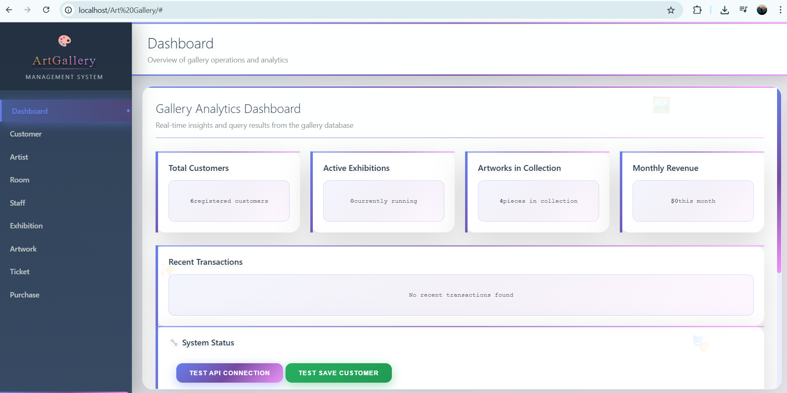
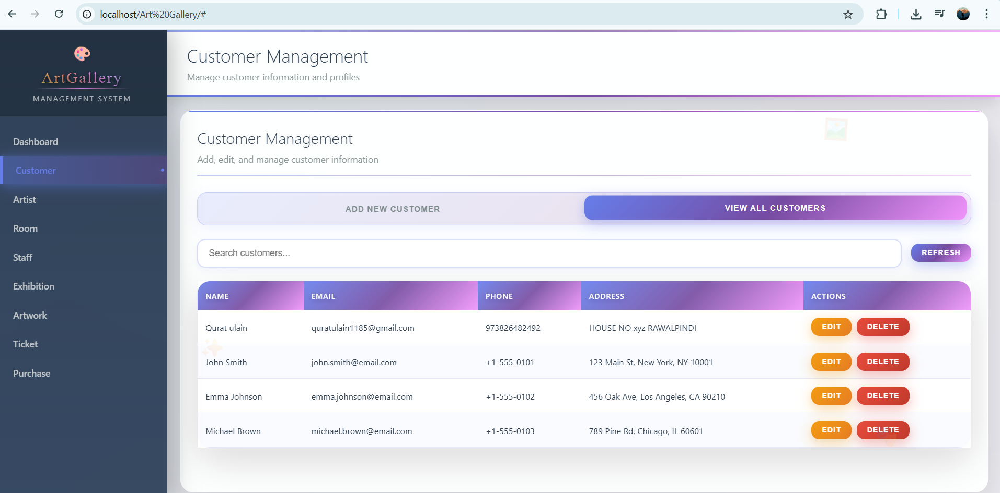
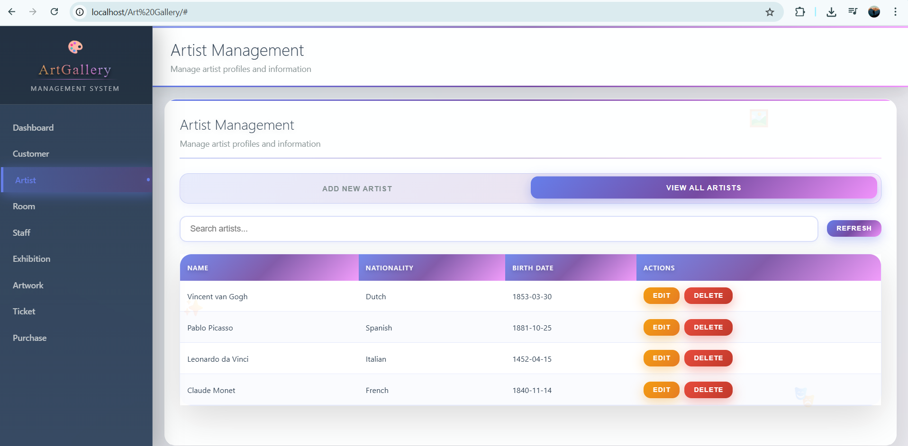
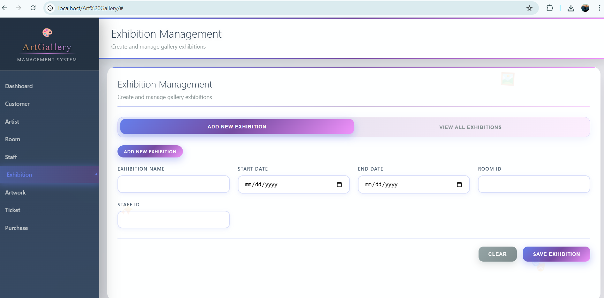
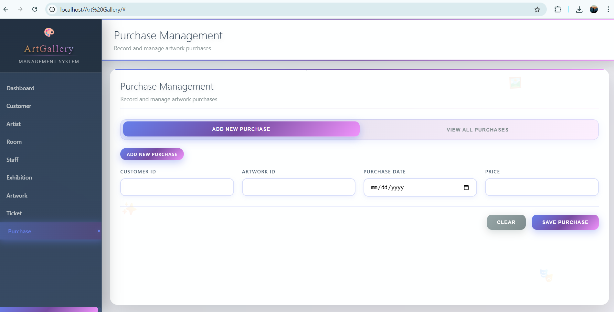

# Art-Gallery-Management-System

1. We install xampp and open it and run both Apache and Mysql.
2. Than open the admin button infront of Mysql.
3. This will open phpMyAdmin. There we will import our database.sql file in api folder.
4. The name of database created at phpMyAdmin should be same as in the sql file.
5. Than we will go on google chrome and write localhost/Art Gallery (folder inside htdocs folder which is in xampp).
   
   

   

   

   

   

